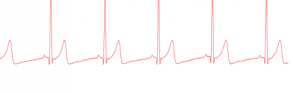
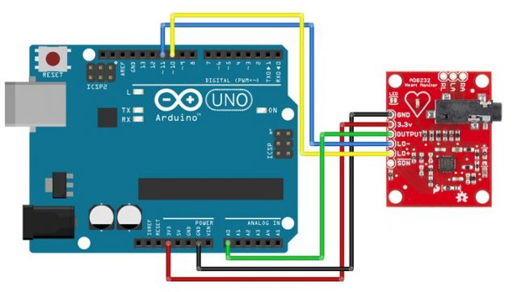

# Programa para monitorização ECG

## Prévia

## Hardware usado:

- Sensor de ECG AD8232

- Arduino UNO R3

- Alguma ProtoBoard

## Conexões

| Board Labal | Pin Function |Arduino |
|---|---|---| 
| GND | Ground | GND |
|3.3v|3.3v Power Supply| 3.3v |
|Output|Output Sgnal| A0|
|LO-|Leads-off Detect -| 11 |
|LO+| Leads-off Detect +|10|
|SDN|Shutdown|Not used|

## Posições dos eletrodos:

(as conexões não seguem o padrão hospitalar por ser um equipamento simples)

- Vermelho -> RA
- Amarelo -> LA
- Verde -> RL

## Representação das conexões

