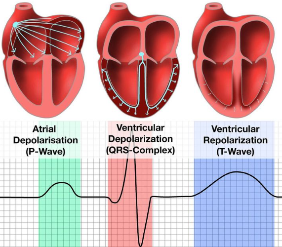
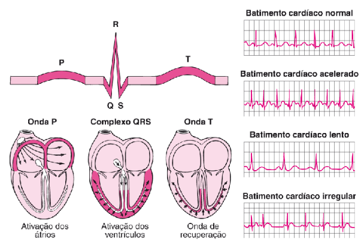
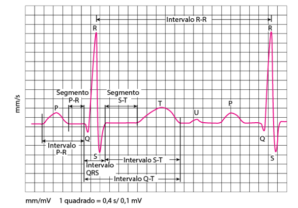

# Programa para monitorização ECG

### ⚠️ Este projeto não é aprovado para uso profissional. Em casos reais utilize equipamentos confiáveis e aprovados para o exercício dentro da medicina ou suporte à vida, seja ela básica ou avançada⚠️

## Prévia da função

**Breve explicação para análise do ECG:**

- Em alguns casos, é comum ver ondas P precedentes, que leva ao quadro de extrassístole ventricular, o que é nada a se preocupar, é apenas uma situação adrenérgica que pode ser controlada por betabloqueadores. ⚠️ Sempre consulte um médico antes de confiar no sistema.
- Também é comum encontrar uma repolarização ventricular, nada fora da normalidade.

## Representação para especialistas da área da saúde, que pode ter omissão neste programa

**O sistema deste programa ainda não é completo, portanto algumas ondas podem ser omitidas, como a onda U, que é recorrente no prolongamento do intervalo QT, sendo sinais de alerta TV do tipo TdeP iminente. Esta é uma das causas que faz deste programa um equipamento não confiável**
**O gráfico deve ser analisado conforme sua programação no código fonte**

## Hardware usado:

- Sensor de ECG AD8232

- Arduino UNO R3

- Alguma ProtoBoard

## Conexões

| Board Labal | Pin Function |Arduino |
|---|---|---| 
| GND | Ground | GND |
|3.3v|3.3v Power Supply| 3.3v |
|Output|Output Sgnal| A0|
|LO-|Leads-off Detect -| 11 |
|LO+| Leads-off Detect +|10|
|SDN|Shutdown|Not used|

## Posições dos eletrodos:

(as conexões não seguem o padrão hospitalar por ser um equipamento simples)

- Vermelho -> RA
- Amarelo -> LA
- Verde -> RL

## Representação das conexões

